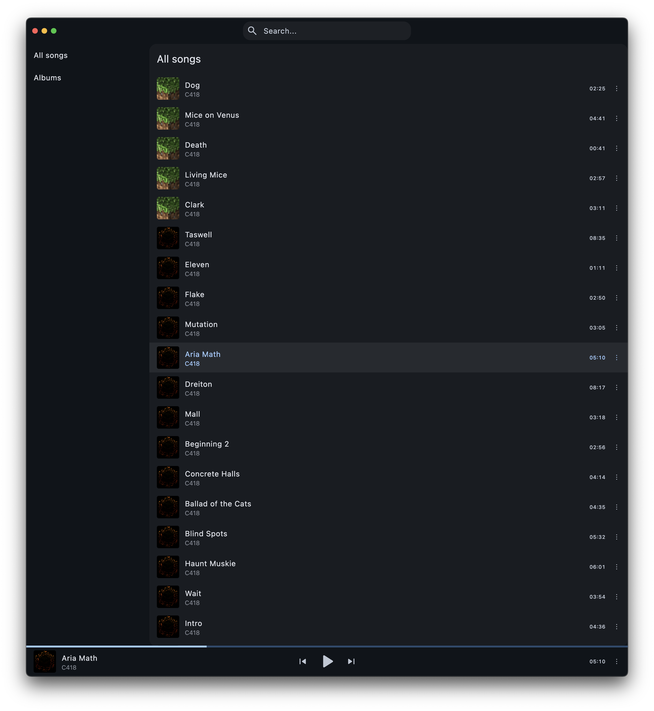

# musique

Free and open-source local music player. I have canceled my Spotify subscription, so I now need something that can play my local music files. I have tried many different apps, but nothing really worked for me. The plan for this project is as follows:

- Simple and clean UI (probably based on m3 expressive) that would be easy to use after Spotify
- Full support for local files (mp3, flac, wav, etc.)
- Support for playlists in m3u format
- Filesystem-first approach with a small SQLite database for metadata. This is really important for me to be able to sync my music folder via Syncthing. This means that my library should be able to sync between my desktop and mobile pretty seamlessly.
- Cross-platform (macOS and Android first, as I use these two. Windows and iOS will come eventually - and I'll probably need help with Linux)
- last.fm scrobbling support
- (maybe?) last.fm integration for music discovery, metadata fetching, etc.

Currently it runs on my macOS, can create a music library from a folder, and play music files one-by-one. That's it. There's still a lot to do, but I use it to listen to a few albums that I own.

I'm also using this project as a "playground" to test some of my approaches to UI design and app architecture.

## Additional information

Feel free to report bugs/issues on GitHub.

If you have questions, you can contact me directly at kk.erzhan@gmail.com.